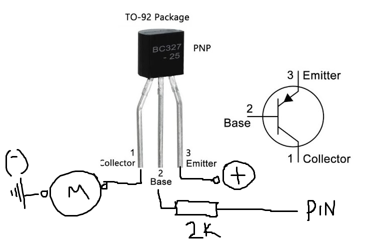

# RC/Bluetooth Car Controller V2
- HC06 at 19200 bps (see here for fixing the speed https://tools.krum.com.ar/save_your_hc-06/)
- Android app Bluetooth RC Controller v2.1

# Prepare ATTiny85

## Burn bootloader
- Upload File -> Examples -> ArduinoISP(11) to Uno or Nano
- Add the following board: https://raw.githubusercontent.com/damellis/attiny/ide-1.6.x-boards-manager/package_damellis_attiny_index.json
- Select ATTiny85 - 8mhz internal - Arduino as ISP
- Burn bootloader connecting as follow

- Burn sketch using same settings. Sketch -> Upload using Programmer

# AtTiny85 Pinout for RC Car

